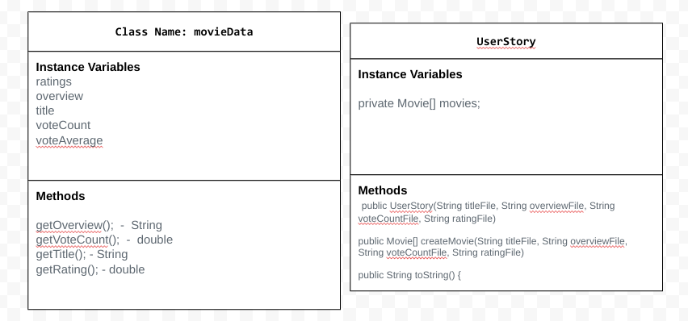

# Unit 3 - Data for Social Good Project

## Introduction

Software engineers develop programs to work with data and provide information to a user. Each user has different needs based on the information they are looking for from data. Your goal is to create a data analysis program for your user that stores and analyzes data to provide the information they need.

## Requirements

Use your knowledge of object-oriented programming, one-dimensional (1D) arrays, and algorithms to create your data analysis program:
- **Write a class** – Write a class to represent your user or business and store and analyze their data with no-argument and parameterized constructors.
- **Create at least two 1D arrays** – Create at least two 1D arrays to store the data that your user needs information about.
- **Write a method** – Write a method that finds or manipulates the elements in a 1D array to provide the information your user needs.
- **Implement a toString() method** – Write a toString() method that returns general information about the data (for example, number of values in the dataset).
- **Document your code** – Use comments to explain the purpose of the methods and code segments and note any preconditions and postconditions.

## User Story

Include your User Story you analyzed for your project here. Your User Story should have the following format:

> As someone who analyzes movies,  
> I want to see which movies have the best ratings,  
> so that I can figure out which movies are the best to watch.

## Dataset

Include a hyperlink to the source of your dataset used for this project. Additionally, provide a short description of each column used from the dataset, and the data type.

Dataset: https://www.kaggle.com/datasets/sankha1998/tmdb-top-10000-popular-movies-dataset
- **title** (String) - The title of each movie.
- **overview** (String) - A description of each movie.
- **vote_count** (double) - The amount of people that voted for each movie.
- **vote_average** (double) - The rating of each movie.
## UML Diagram

Put and image of your UML Diagram here. Upload the image of your UML Diagram to your repository, then use the Markdown syntax to insert your image here. Make sure your image file name is one work, otherwise it might not properly get display on this README.

## Description

Write a description of your project here. In your description, include as many vocab words from our class to explain your User Story, the chosen dataset and how your project addressed that users goals. If your project used the Scanner class for user input, explain how the user will interact with your project.

Our project is for movie lovers and those who wish to see the information off different movies. Our goal is to provide the user the title, overview, vote count, and ratings on different movies. This allows the user to see the information of each movie and chose which one they like the best to watch. In this project we used for loops, 1D arrays, toString methods, get methods, and enhanced for loops. This project addresses the user's story because it provides the information the user would need to see for each movie. 
